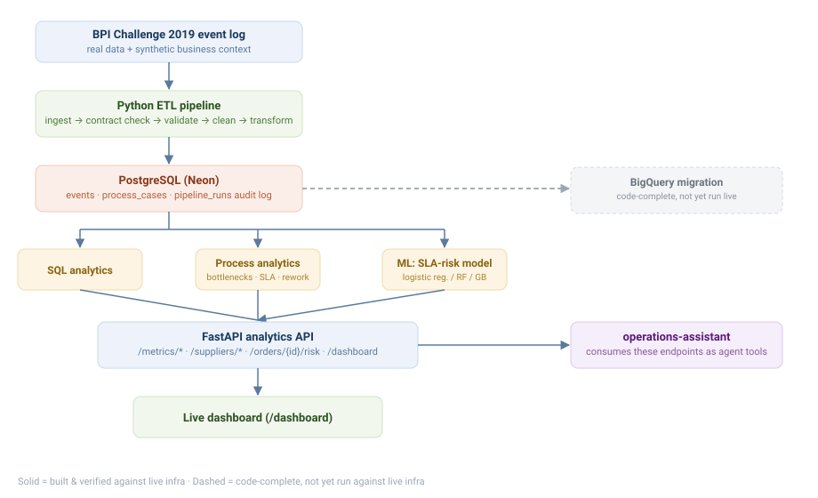

# Operations Performance


**🔗 [Live API](https://operations-performance.onrender.com/docs)** — interactive Swagger docs for
the deployed analytics API, running against a real Postgres instance (Neon) loaded with real BPI
2019 procurement data. See [`operations-assistant`](https://operations-assistant.onrender.com) for
a conversational interface over this same data. Free-tier hosting, first request may be slow to
wake up.

An operations analytics and process-intelligence platform for a Procure-to-Pay (P2P) process —
built for a fictional client, **Northstar Manufacturing** — that identifies bottlenecks, SLA
failures, process deviations, and supplier performance issues, and turns them into evidence-backed
recommendations.

Pairs with [`operations-assistant`](../operations-assistant), which lets a user *investigate*
these findings conversationally, combining this project's data with company policy documents.

## Data
- **Real:** BPI Challenge 2019 procurement event log (public process-mining dataset)
- **Synthetic:** business-unit, SLA-rule, and supplier-context fields not present in the real log

Full breakdown in [`docs/data-contract.md`](docs/data-contract.md).

## Stack
Python · Pandas · SQL · PostgreSQL · scikit-learn · MLflow · SHAP · FastAPI · Docker · BigQuery · GCP

## ML experiment tracking
`src/ml/tune.py` runs `RandomizedSearchCV` (with `TimeSeriesSplit`, not a random k-fold —
this is process data, a random split would leak future information into training) for the
SLA-risk model, logging every run to MLflow. Real experiment history, not a config file:
model name, hyperparameters searched, per-run ROC-AUC, all queryable via `mlflow ui`.

```bash
python -m scripts.tune_model     # runs the search against live data, logs to MLflow
mlflow ui --backend-store-uri sqlite:///mlflow.db   # inspect runs at localhost:5000
```

Explainability is real too, not a proxy: `src/ml/explain_shap.py` uses `shap.Explainer`
(auto-dispatches to the correct algorithm for whichever model won training) for genuine
per-prediction SHAP values, not just global feature importance filtered to a row.

## Sample analytical SQL
One of several window-function queries in [`sql/analysis/`](sql/analysis/) — bottleneck
detection via `LEAD()` to compute stage-to-stage duration per case, ranked by average
delay contribution (full file: [`sql/analysis/bottlenecks.sql`](sql/analysis/bottlenecks.sql)):

```sql
WITH stage_durations AS (
    SELECT
        case_id,
        activity || ' -> ' || LEAD(activity) OVER (PARTITION BY case_id ORDER BY timestamp) AS stage,
        EXTRACT(EPOCH FROM (
            LEAD(timestamp) OVER (PARTITION BY case_id ORDER BY timestamp) - timestamp
        )) / 3600.0 AS duration_hours
    FROM staging.events
)
SELECT
    stage,
    COUNT(*)                                                        AS case_count,
    ROUND(AVG(duration_hours)::numeric, 3)                          AS avg_hours,
    ROUND(PERCENTILE_CONT(0.5) WITHIN GROUP (ORDER BY duration_hours)::numeric, 3) AS median_hours,
    ROUND(PERCENTILE_CONT(0.9) WITHIN GROUP (ORDER BY duration_hours)::numeric, 3) AS p90_hours
FROM stage_durations
WHERE stage IS NOT NULL
GROUP BY stage
ORDER BY avg_hours DESC;
```
Verified against a hand-derived golden dataset (`docs/data-correctness-audit.md`) — the
query's output was checked against independently-calculated expected values, not just
"it runs and returns something plausible."

## Architecture


## Status
See [`FEATURES.md`](FEATURES.md) for the full, tiered feature specification and definition of done.

## Running locally
```
cp .env.example .env        # fill in DB credentials
pip install -r requirements.txt
python -m scripts.setup_database
python -m scripts.run_pipeline
python -m scripts.run_analysis    # starts the API at http://localhost:8000/docs
```
Scripts are run as modules (`python -m scripts.foo`, not `python scripts/foo.py`) -- the latter
puts `scripts/` on `sys.path` instead of the repo root, which breaks every `from src...` import in
the codebase. This was actually broken in this repo until Phase 30's benchmark run caught it (see
`docs/performance-notes.md` and `PLAN.md`) -- the fix was adding `scripts/__init__.py` and
switching every documented invocation to the `-m` form, which is what's shown above.
