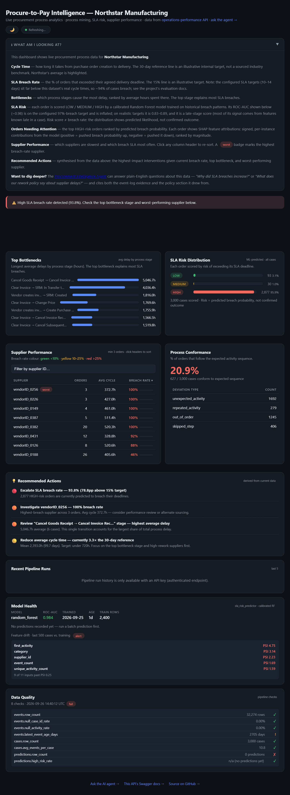
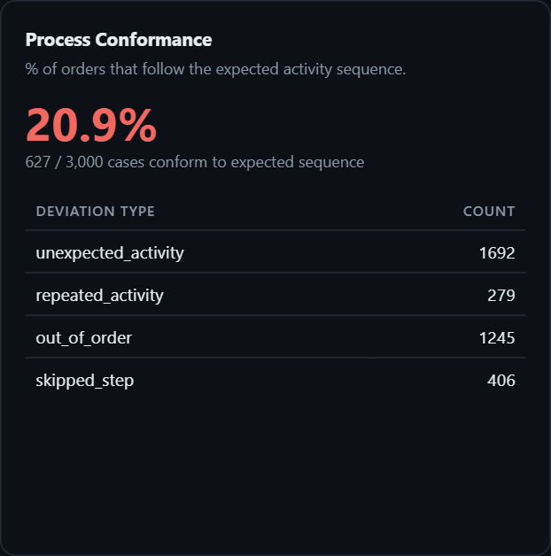
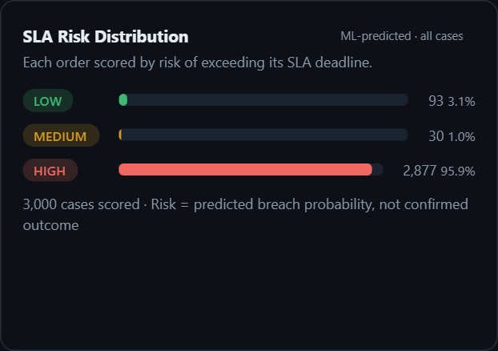
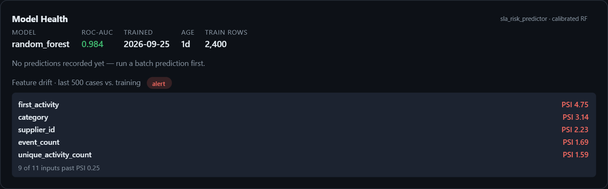

# Dashboard

**Live:** <https://operations-performance.onrender.com/dashboard> (free tier; the first load can take ~30 s to wake).
Served by the API itself (`src/api/dashboard.py` + `src/api/dashboard.html`), so every tile reads the same endpoints
`operations-assistant` uses. There is no separate BI file: an earlier version of this README was a Power BI /
Looker Studio build spec that was never built, and it is replaced by this page.

## What each section answers
| Section | Question it answers | Source |
|---|---|---|
| KPI row | How long do orders take, and how many breach the configured SLA? | `/dashboard/data` (cycle time, SLA) |
| Top Bottlenecks | Which stage transition loses the most time? | `/dashboard/data` (bottlenecks) |
| SLA Risk Distribution | How many open cases does the model score LOW / MEDIUM / HIGH? | model scores over all cases |
| Supplier Performance | Which suppliers are slow or breach most (min 3 cases)? | `/suppliers/performance` logic |
| Process Conformance | What share of cases follow the log's most common path, and how do the rest deviate? | `/metrics/conformance` |
| Recommended Actions | Rule-based summary of the above | computed in the page |
| Model Health | Model version, age, ROC-AUC, per-feature drift (PSI) | `/health/model`, `/health/drift/features` |
| Data Quality | Pipeline checks on the loaded tables | `/observability/data-quality` |

Orders Needing Attention and Recent Pipeline Runs need an API key and are empty for anonymous visitors.

| | |
|---|---|
|  |  |

## Read these numbers with their caveats
- **93.8% breach rate** is a property of the configured SLA targets (10-14 days) against this dataset's real cycle
  times, not a finding about suppliers. See `docs/evaluation.md`.
- **ROC-AUC ~0.98** in Model Health is measured on that 97%-breach target and is inflated; on realistic targets the
  model scores 0.83-0.89 and is a late-stage triage score.
- **Feature drift "alert"** compares the last 500 cases of a static sample with its training window, not live traffic
  (`docs/feature-drift.md`).
- **Data freshness warning (2,700+ days)** is expected: BPI 2019 is a 2018 event log.
- **"No predictions recorded yet"**: batch predictions are not persisted to `analytics.sla_predictions` in the deployed
  database, so that data-quality check fails honestly.

## Fixed while producing these screenshots (2026-09-26)
- **Conformance was 0.0% by construction.** `config/process.yaml` listed a textbook P2P path whose activity names do
  not exist in BPI 2019. It now uses the log's most frequent variant, giving **20.9%** conformant cases (627 of 3,000),
  with out-of-order (vendor invoice before/after goods receipt) and unexpected steps as the main deviations.
- **A supplier showed a 0.0 h average cycle time.** 104 cases (96 single-event, 8 with one shared timestamp) have no
  measurable duration; the supplier scorecard now excludes them. They are still counted as non-breaches by the SLA and
  model code, which is a known open issue.
- The "industry benchmark 30-60 days" line was unsourced; it is now labelled an illustrative internal reference.

Screenshots were captured from a local run of this API against the same Neon database (html-to-image in the browser).
