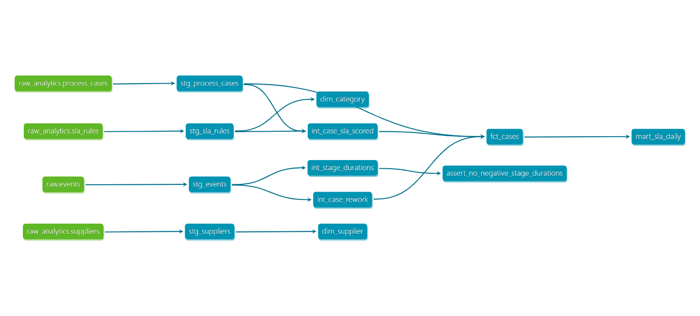

# dbt transformation layer (Phase 2)

Reproduce: `cd dbt && dbt build --profiles-dir . --project-dir .` (needs the same `DB_*` env vars
every other script in this project uses -- `set -a && source ../.env && set +a` on macOS/Linux,
or export them manually). CI runs the same build against a fresh Postgres service container on
every push -- [`.github/workflows/dbt.yml`](../.github/workflows/dbt.yml).

## Layers

| Layer | Models | What it does |
|---|---|---|
| staging | `stg_events`, `stg_process_cases`, `stg_suppliers`, `stg_sla_rules` | 1:1 with the raw tables (`staging.events`, `analytics.process_cases`/`suppliers`/`sla_rules`), no transformation |
| intermediate | `int_stage_durations`, `int_case_rework`, `int_case_sla_scored` | The dbt-model versions of `sql/analysis/bottlenecks.sql` and `sql/analysis/rework_detection.sql`'s CTEs (reused as real models, not copy-pasted), plus the SLA breach join |
| marts | `fct_cases`, `dim_supplier`, `dim_category`, `mart_sla_daily` | One row per case; supplier and category dimensions; a daily SLA rollup |

`dim_category`, not `dim_business_unit`: this project's data has no `business_unit` field
(`docs/data-contract.md`). `category` is the real segmentation column used throughout (same note
already in `sql/analysis/rolling_sla_breach_rate.sql`) -- named honestly rather than aliased to
imply a column that doesn't exist.

## Tests

`unique`/`not_null` on every primary key, `relationships` from `fct_cases` to both dimensions,
and one custom singular test, `assert_no_negative_stage_durations.sql` -- a stage-to-stage
duration should never be negative (would mean out-of-order timestamps or a bug in
`int_stage_durations`). Passes on live data: `staging.events` is already the cleaned output of
`src/cleaning/clean_events.py`, not raw.

## Two real findings from `dbt build`'s relationship tests, not from inspection

The `relationships` tests are set to `severity: warn`, not `error` -- and they both fired, at
counts too large to be an expected small gap:

1. **`analytics.suppliers` is completely empty (0 rows).** Every one of `fct_cases`'s 3,000 rows
   fails the relationship to `dim_supplier`. Checked whether this breaks anything live: no code
   in `src/api/` or `scripts/` reads `analytics.suppliers` -- it's an unpopulated table the ETL
   pipeline never wrote to, not a production bug.
2. **`analytics.sla_rules` only has 3 categories** (`default`, `3-way match`, `Consignment`)
   while `analytics.process_cases.category` has 10+ real spend categories (Additives, Logistics,
   Marketing, ...). 2,972 of 3,000 `fct_cases` rows fail the relationship -- meaning almost every
   case falls back to the 240-hour default SLA target in `int_case_sla_scored`'s
   `COALESCE(r.target_hours, 240)`, not a real per-category target. This was already true of the
   existing Python pipeline (`src/analytics/sla_analysis.py` has the identical fallback) -- dbt's
   test is what made it visible as a number (2,972/3,000), not a new problem it introduced.

`severity: warn` was the right call for both: an `error` here would fail `dbt build` on a real,
pre-existing data gap rather than a bug in these models.

## Lineage

Captured from a live `dbt docs generate` + `dbt docs serve` run (`target/catalog.json` against
the real database), not hand-drawn.

## ML feature builder, optionally reading from `fct_cases`

`src/ml/features.py::load_evaluated_cases_from_dbt_marts()` reads `dbt_marts.fct_cases` instead
of the raw-events path (`load_cases()` + `evaluate_sla()`), with matching column names, so it can
be handed straight to the unmodified `build_features()`. Opt-in via `FEATURE_SOURCE=dbt_marts`
(checked by `feature_source_is_dbt_marts()`) -- not the default, since running `dbt build` is an
extra step the existing pipeline doesn't require.

**Verification status:** see the parity-check result recorded in the commit that adds this
section -- run against live data with rows aligned by `case_id` (an unaligned first attempt
produced a false mismatch, caught and fixed before being reported as a result).
