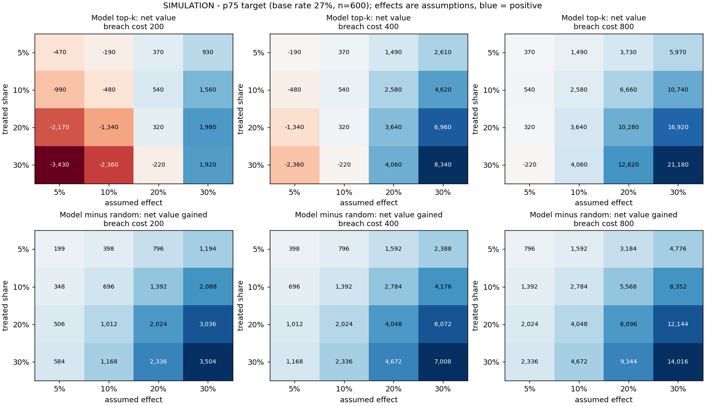

# Intervention ROI and uplift method (Phase 6)

> **This is a simulation.** No intervention has ever been run on this data (a public event log), so no
> effect size here was measured. Every number in `/roi/summary` is an arithmetic consequence of the
> assumptions in [`config/interventions.yaml`](../config/interventions.yaml), and the API says so in
> its `label` field and echoes the assumptions back.

## What exists
- `analytics.interventions` (`sql/schema/005_create_interventions.sql`): one row per action on a case:
  type, model risk at the time, cost, outcome once known, and `is_simulated`. One row per (case, type).
- `POST /interventions` (admin role): validates type against the policy, risk in [0, 1], cost ≥ 0,
  and that the case exists (422 / 404 / 409 on duplicates). It uses a separate write engine
  (`LEDGER_DB_USER`/`LEDGER_DB_PASSWORD`, falling back to `DB_USER`), because the API's normal
  credential is the SELECT-only `ops_api_reader` role by design.
- `GET /roi/summary`: simulated and logged rows reported **separately**, never blended.
- `python -m scripts.simulate_interventions`: policy replay — act on the top 20% of the held-out window
  (last 20% by start time, unseen in training) by model risk with `expedite_approval`; loads
  `is_simulated = TRUE` rows, idempotently.

## Arithmetic
For each treated case, the assumed relative effect *e* of its type cuts breach probability by *e*.
- Avoided breaches (by model risk) = Σ risk × e. Avoided (by observed outcomes) = Σ e over treated
  cases that did breach (only where the outcome is known).
- Net value = avoided × `breach_cost` − Σ cost.
- Break-even effect = Σ cost / (`breach_cost` × Σ risk): the uniform effect at which net value is zero.
  This is the honest headline, because it doesn't depend on a guessed effect.

## Live simulation result
120 interventions, cost 3,000, 17.96 avoided breaches by model risk (18.0 by observed outcomes), net
+4,183 (+4,200). (Rerun after the calibration fix; earlier: 18.0 / 17.4, +4,200 / +3,960.) **Break-even effect: 6.25%** — under these assumed costs and a 400 breach cost, the
action pays for itself if it prevents more than ~1 breach in 16 among treated cases.

## Why this is not uplift, and what real uplift needs
- **Effect sizes are assumed.** Uplift is the *difference in outcome caused by treatment*; it cannot be
  read from a risk model. A risk score says who is likely to breach, not who is *helped* by an action —
  high-risk cases may be unfixable, and the best targets are often mid-risk.
- **The counterfactual is missing.** A real estimate needs a randomized holdout (treat a random share of
  flagged cases, leave the rest), then compare breach rates, ideally with an uplift model (two-model or
  causal-forest) trained on that data. The ledger (`applied_at`, `breached_after`) is shaped to collect it.
- **Risk scores are the served model's probabilities** -- the sigmoid-calibrated random forest
  (`bundle["model"]`, a `HeldOutCalibratedClassifier`; calibrated on a held-out temporal slice, see
  [`calibration.md`](calibration.md)). The configured SLA targets make ~94%
  of cases breach, so the top-20% by risk are nearly all ≈1.0 risk. Consequently "by model risk" and "by
  observed outcomes" nearly agree here, and the ranking adds little over acting on any 20% of cases. On a
  less degenerate target (see [`less-degenerate-target.md`](less-degenerate-target.md)) triage would matter more.
- Cost and breach value are placeholders; change them in the YAML and rerun to see the sensitivity.

## Sensitivity on a non-degenerate target (Fix 2)

Reproduce: `python -m scripts.roi_sensitivity` -> `reports/roi_sensitivity.json` (committed, raw),
[`roi-sensitivity.png`](roi-sensitivity.png); the same grid is returned by `GET /roi/summary` under
`sensitivity`. Same held-out window as everywhere else (last 20% by start time, n = 600). Grid: treated
share {5, 10, 20, 30%} x assumed effect {5, 10, 20, 30%} x breach cost {200, 400, 800}, 25 per treatment.
Outcomes are the cases' actual breaches; only the *effect* is assumed. **SIMULATION.**

**p75 target** (breach = above the training-window per-category p75, base rate 27%; p75-trained RF,
sigmoid-calibrated on a held-out temporal slice, ROC-AUC 0.858). Treat 20% of cases, assumed effect 10%,
breach cost 400:

| Who gets treated | Precision (breaches among treated) | Net value | Break-even effect |
|---|---|---|---|
| Top 20% by model risk | 0.692 | **+320** | 9.0% |
| Top 20% by supplier history rule (no model) | 0.675 | +240 | 9.3% |
| Random 20% | 0.270 | -1,704 | 23.2% |
| Busiest suppliers first | 0.100 | -2,520 | 62.5% |

The model's precision lift over random is +0.66 / +0.58 / +0.42 / +0.32 at 5 / 10 / 20 / 30% treated, with
bootstrap 95% CIs all excluding 0 (e.g. +0.32 to +0.49 at 20%). So on a realistic target triage **does** have
business value in this simulation: random targeting needs a ~23% effect to break even, the model ~9%.

**But a one-feature rule gets almost all of it.** Ranking cases by the causal supplier historical breach rate --
no model -- captures **100% / 106% / 96% / 81%** of the model's net-value advantage over random at 5 / 10 / 20 /
30% treated (effect 10%, breach cost 400; e.g. at 20%: +1,944 vs +2,024). At small treated shares the rule is as
good as the model or better. The model's edge only shows at the largest share. Any claim that this model adds
business value should therefore be made against the rule, not against random.

At a 5% effect and breach cost 200 nothing pays for itself (net -500 to -3,340 depending on share); that region
is in the grid, not hidden. **Not run: "highest order value first".** This dataset has no order-value column
(recorded in the JSON as `strategies_not_run`), so it could not be compared honestly; busiest-supplier stands in
as the nearest available business rule, and it is *worse than random*.

**Configured target** (~97% breach in the window): every strategy is within 3 points of random by construction
(the maximum possible precision lift is 0.03). The served model reaches precision 1.0 at every share, a lift of
+0.030 [+0.018, +0.043] -- statistically real, practically negligible, and net values are within 150 of random.

### Correction history
An earlier version of this section (2026-09-25) reported the model's p75 net value as +720 and the rule as
capturing "about 80%". Those figures used a forest fitted on the full training window and calibrated in-sample;
after the calibration fix the forest is fitted on 80% of it, ROC-AUC fell from 0.876 to 0.858, and the rule now
captures 96% at 20% treated. Also found while producing them: the served isotonic calibrator (fitted on the
forest's own training rows) had ROC-AUC 0.665 vs 0.986 raw; fixed in [`calibration.md`](calibration.md).

Reproduce the ledger simulation: `python -m scripts.setup_database && python -m scripts.simulate_interventions`, then `GET /roi/summary`.
